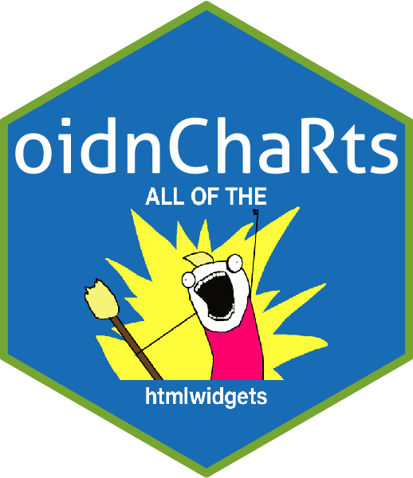
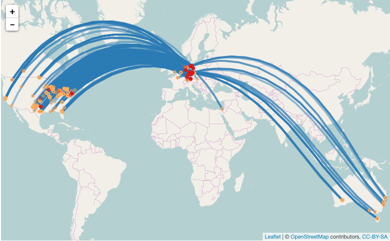

<!-- README.md is generated from README.Rmd. Please edit that file -->
oidnChaRts
==========

[](https://cran.r-project.org/package=oidnChaRts) [](https://travis-ci.org/ox-it/oidnChaRts) []() [](https://codecov.io/gh/ox-it/oidnChaRts)

A collection of functions for building generic interactive `htmlwidget` visualisations, primarily to compare library "A" vs "B" but also usable in their own right.



Functions are in general called as follows:

``` r
library(oidnChaRts)
geo_lines_plot(data_geo_lines_plot, 
              library = "leaflet")
```



Installing
==========

This library is unlikely to be submitted to CRAN, it must be installed as follows:

``` r
devtools::install_github("ox-it/oidnChaRts")
```

License
=======

Please note that the examples within this package use JavaScript libraries that have restrictive licensing conditions.

The `highcharter` library is dependent on [highcharts.com](highcharts.com) which is free for non-commercial use only. Please review the licensing options and terms before using this software, as the oidnChaRts license neither provides nor implies a license for Highcharts.

All code within this library is made available under the MIT License.

Credits
=======

The majority of the credit for this library belongs to the `htmlwidget` library developers, including:

-   <https://github.com/jbkunst/highcharter>

-   <https://github.com/ramnathv/htmlwidgets>

-   <https://github.com/rstudio/leaflet>

-   <https://github.com/ropensci/plotly>
